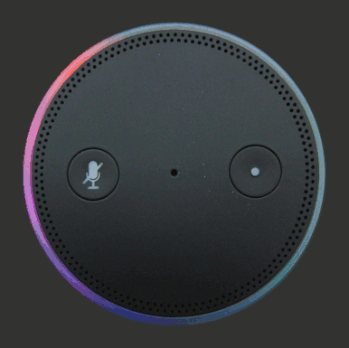

# Echo LED Simulator

This simple web app lets you manipulate individual LEDs of a mocked [Amazon Echo](https://www.youtube.com/watch?v=KkOCeAtKHIc), and ultimately create animations.

If you want to add your own animation, see [js/animations.js](js/animations.js).

Demo: http://krzeminski.it/amazon/echoledsimulator/

**Protip: for best performance, use Google Chrome.**
